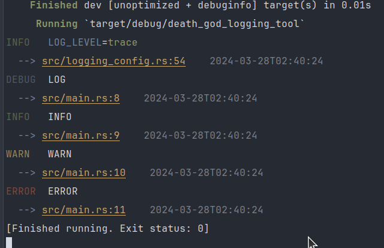

# death_god_logging_tool
 Настройка логирования с навигацией по коду.

## Крейт с настройками логов.

### Идея
Облегчить чтение большого количества коротких логов 
с одновременной навигацией по коду. Ссылки кликабельны в VsCode и Intellij.

### Настройка
Крейт берет преременные из окружения.

Уровень удобно указать в виде
```bash
LOG_LEVEL=warn,<your_app>=trace
```


Если указан абсолютный путь к лог файлу, запись будет производиться в него.
```bash
LOG_FILE_PATH=/data/logs.txt
```

### Пример

```toml
# Cargo.toml

[dependencies]
death_god_logging_tool = "1.x.x"
log = "x.x.x"
```

```rust
use death_god_logging_tool::conflog;

fn main() {
    // Print logs
    std::env::set_var("LOG_LEVEL", "error,death_god_logging_tool=debug");

    conflog::init();

    log::debug!("LOG - принт");
    log::info!("INFO - принт");
    log::warn!("WARN - принт");
    log::error!("ERROR - принт");

    // Save logs to file. No print
    std::env::set_var("LOG_FILE_PATH", "./logs.txt");

    conflog::init();

    log::debug!("LOG - записть в лог-файл");
    log::info!("INFO - записть в лог-файл");
    log::warn!("WARN - записть в лог-файл");
    log::error!("ERROR - записть в лог-файл");

}

```
```console
   Compiling death_god_logging_tool v1.0.3 (/home/death/my_projects/death_god_logging_tool/logging)
    Finished dev [unoptimized + debuginfo] target(s) in 0.55s
     Running `target/debug/death_god_logging_tool`
INFO   LOG_LEVEL=trace    
  --> src/logging_config.rs:54    2024-03-28T02:43:51
DEBUG  LOG                               
  --> src/main.rs:8    2024-03-28T02:43:51
INFO   INFO                              
  --> src/main.rs:9    2024-03-28T02:43:51
WARN   WARN                              
  --> src/main.rs:10    2024-03-28T02:43:51
ERROR  ERROR                             
  --> src/main.rs:11    2024-03-28T02:43:51
[Finished running. Exit status: 0]

```


